## Installation

1. Clone the repo

```
git clone git@github.com:jordanshardy/SquarePlants.git
```

2. Bundle install dependent gems

```
bundle install
```

3. Set up rails database migrations

```
rails db:setup
rails db:migrate
rails db:seed
```

4. Open [http://localhost:3000](http://localhost:3000) in browser

## Identification of the problem and why it needs solving

- Years ago when I first started growing plants like succulents and other indoor plants, it was a challenge to keep them alive and turned out to be a very expensive endeavor. After seeing apps and software that can identify (although not very good) a plant by a picture, I realized I would often struggle to find the best practices for watering schedules and light exposure and the recommended information on many sites and even the new plants themselves often don’t work. There’s too many variables in a plants environment to follow generic directions, and so a resolution is to turn to the community and others that have experience with many different variables. While reddit is a great place for questions and answers, I also think a solution is tracking the progress of a plants growth to understand why they’re not healthy or dying.

- After searching the web for similar solutions to solve these problems, I found “grow journals” for cannabis is the states. Websites dedicated to cannabis cultivation with users sharing periodic blog posts during the lifecycle of the plant.

- Similarly, a grow journal for normal plants would also solve the problem of a dedicated community for plants, and provide an easy way to share the growth journey of a plant, and get any advice on issues.

- As I kept thinking about the lack of resources out there for like minded plant owners I was continuing to spend about $100 per week on plants. Then, I learned about cloning or propagating and started to take plant cuttings which is free! I’ve been cutting and propagating now for about 6 months but I only have so many plants, and it would be great to have some variety. This sparked an idea to have a marketplace where people can post, trade and sell plants and track each others plants and buy/trade for specific plants clones.

## Link to deployed app

[https://git.heroku.com/squareplants.git](https://git.heroku.com/squareplants.git)

## Link to github repo

[https://github.com/jordanshardy/SquarePlants](https://github.com/jordanshardy/SquarePlants)

## Description of your marketplace app

### Purpose

To create a community of plant lovers where people can share their knowledge and experiences. Unlike reddit, Squareplants will also help users track the progress of their plants as they grow in a journal style blog.
Squareplants lowers the accessibility to plants lowering the cost for potential plant owners.
Squareplants gives people an extra source of income by selling their plants/clones

### Functionality / features

- Squareplants allows user of the site to be a casual viewer that can view posts but not interact with the site.

- Users also have the option to signup, making them members and giving them full access to the site and the option to create blog posts associated with a specific plant, as well as buy and sell on the site.

- To sell on the site, members can create listings to trade and sell clones to other users. Clones or clippings from plants can be advertised and the user can choose to either sell the clone for cash, or trade for other members/sellers of clippings.

- Members don’t have to sell in order to buy, but once signed up, anyone can purchase clones if they don’t have any listed to trade. The purchase is completed online and then the clone is shipped by the seller.

- Users can also tag their blog posts and search tags for specific posts

- User may wish to search for posts based on tags. There is a tagging and search feature that allows users to do so. This will be important when a user is looking for a specific plant or plant with a specific feature.

### Sitmap

<a name="sitemap"></a>

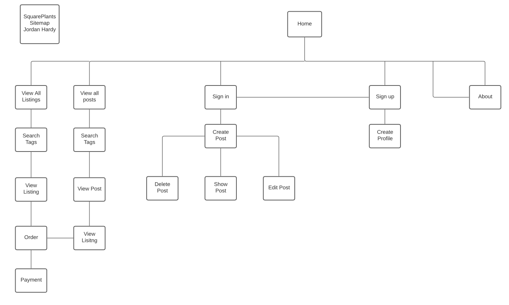

## Screenshots

### Home Page

<a name="homepage"></a>

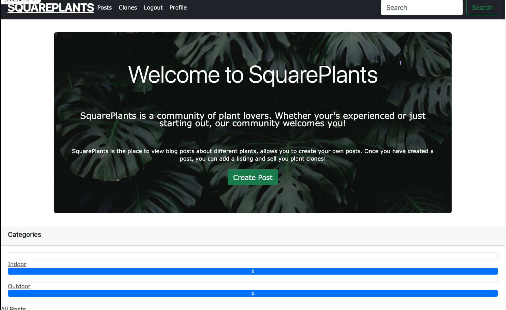
<a name="homepage"></a>

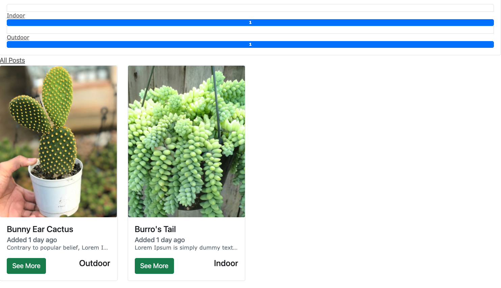

### Posts Page

<a name="posts"></a>

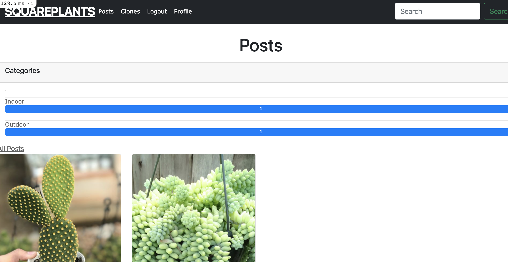

### Sign Up

<a name="signup"></a>

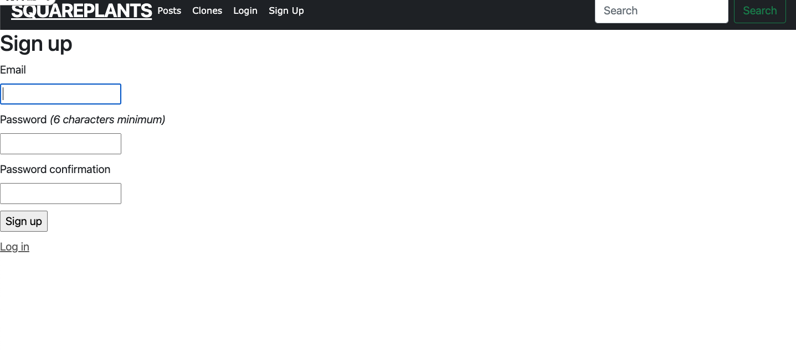

### Listings

<a name="Listings"></a>

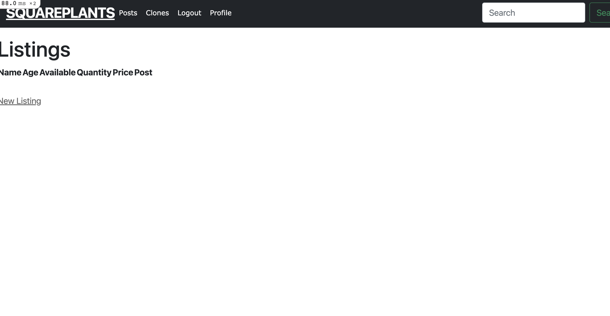

### Profile

<a name="profile"></a>

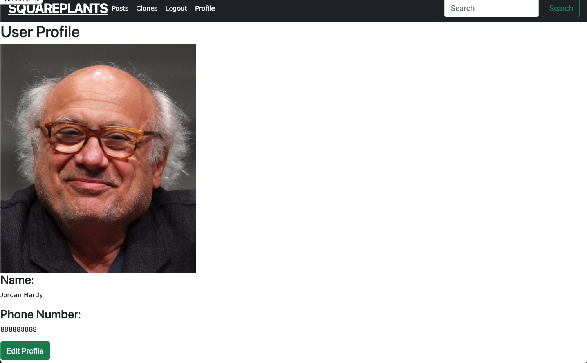

### Update Profile

<a name="updateprofile"></a>

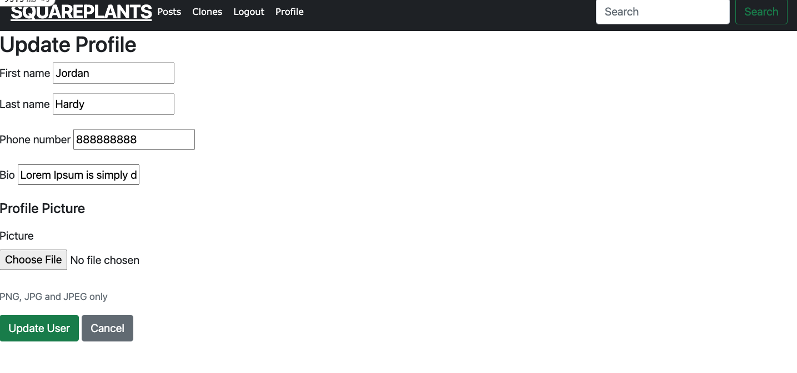

### Target Audience

- Expert plant owners that wish to share their knowledge with others, especially those of a lesser
  Individuals looking to interact with others to learn about growing house plants.

- Individuals looking for a community that shares similar interests

- Individuals who are wanting a cheaper option to purchase plants.

- Individuals that are wanting a way to make money and create another income stream.

### Tech Stack

- Languages
  HTML5 - Website Markup
  CSS3 - Website Styling
  JavaScript - Website Styling
  Ruby - Application language
  Rails - Server-side application framework
  PostgreSQL -Relational Database Management System
  Heroku - Cloud Platform for hosting web applications
  Amazon S3 (Simple Storage Service) - Cloud Object Storage via a web service interface

## User Stories

### As a guest

- I want to be able to view blog posts of other users so that I can learn about plants and see others plants grow
- I want to be able to view all blog posts of a user so that I can track another users plants and progress.
- I want to be able to sign up to become a buyer and seller so that I can access the full features of the website
- I want to to be able to search categories so that I can find posts with specific tags

### As a member (user that signs up)

- I want a secure way to sign up so that others cannot access my personal information
- I do not want people to be able to edit or delete my posts
- I want to be able to create blog posts which allows me to periodically add journal entries and pictures relating to many plants so that I can track plant growth
- I want to be able to tag my posts so that I can see other posts with the same categories
- I want to be able to edit posts so that I can update information about a plant
- I want to be able to delete a post if it is no longer relevant

### As a seller

- I want to be able to create listings so that I can sell clones of the plants featured in my posts
- I want to be able to update my listing including the amount of clones for sale/trade
- I want to be able to receive digital payment so that I can have a secure way of selling my clones

### As a buyer

- I want to be able be able to securely purchase plants from sellers so that - I can get the best value for money
- I want to be able to receive a receipt from my purchase so that I have a record

## Wireframes

### Homepage

<a name="homepage"></a>

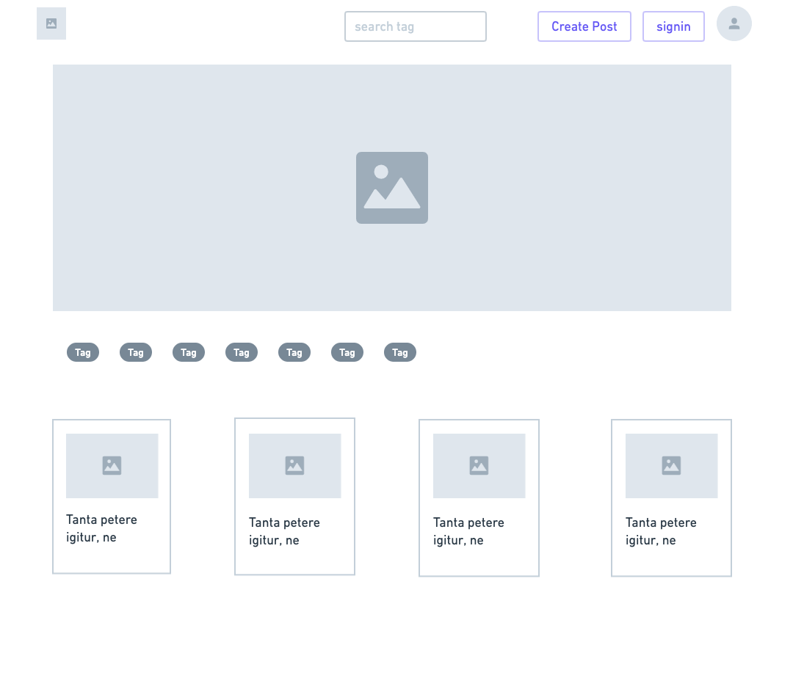

### Post

<a name="post"></a>

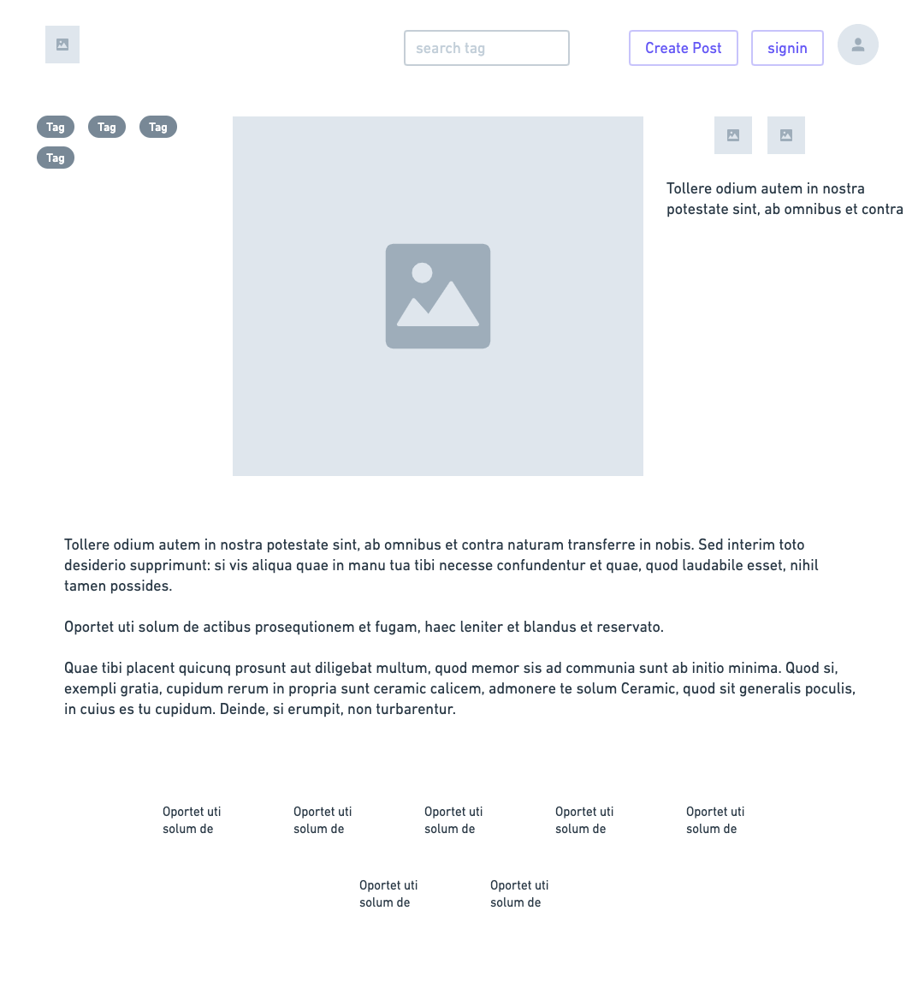

### Listing

<a name="listing"></a>

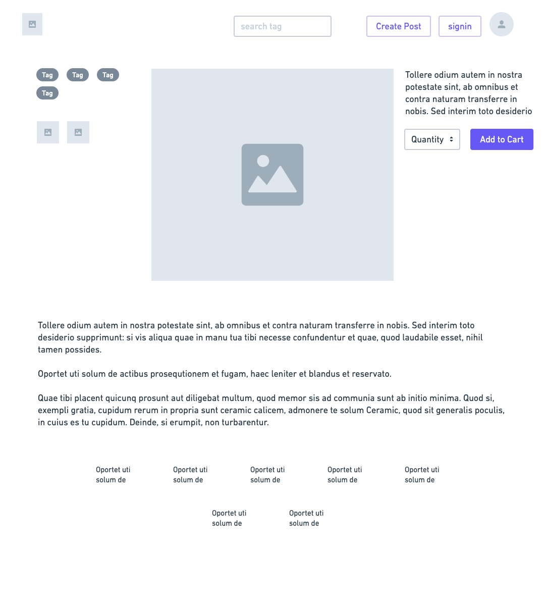

### Profile

<a name="profile"></a>

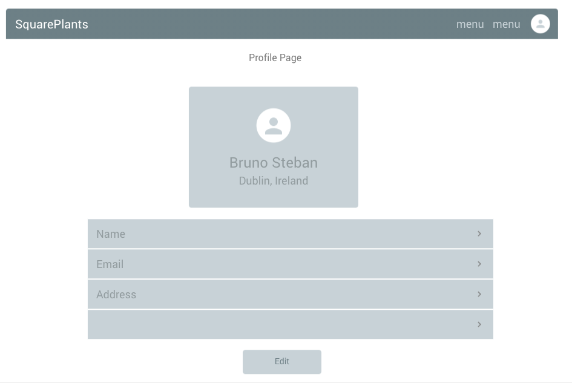

### SignUp

<a name="signup"></a>

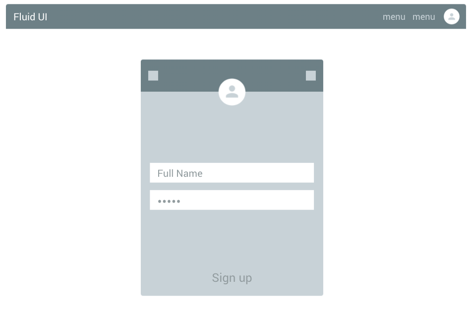
## Entity Relationship Diagrams

### Initial ERD

<a name="initialerd"></a>

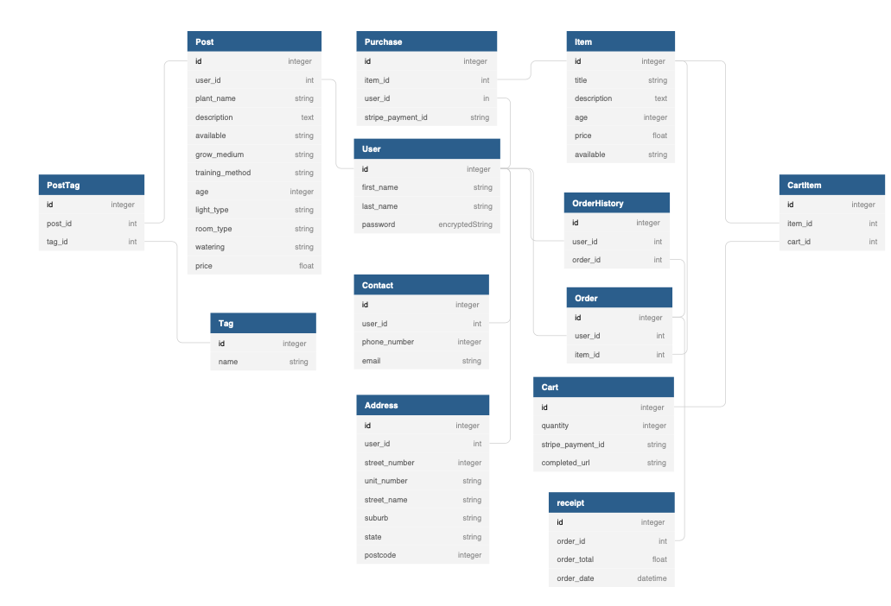

### Final ERD

<a name="erdfinal"></a>

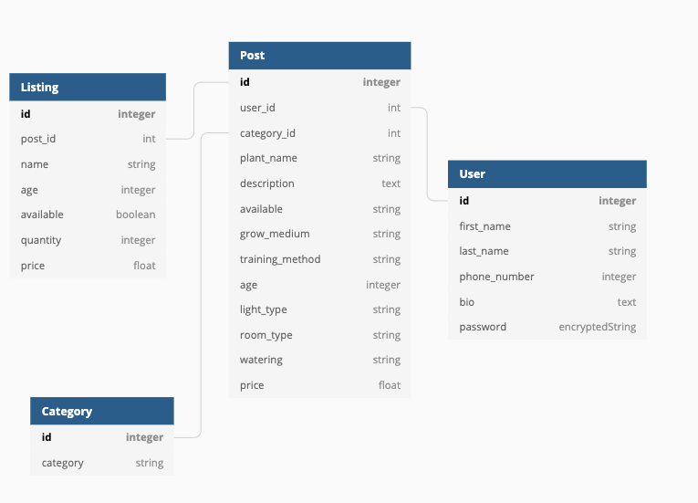

## Explain the different high-level components in your app

Using rails as the web frame work for the app makes it simple to interact with the models (database and tables) and the associations between them. With these models, we're able to easily change the routes we wish to display to the browser through the controllers and then display content to the using through the specific views.

Although rails makes this easy using scaffolds, not all routes and controllers are necessary. For this app however, because of the interaction with models like the users and posts, and the relationship they have with listings and the home page, it is necessary to utilize all controllers, but not all routes specified in the controllers were needed for the desired interactions.

User interaction with the routes is best kept in an easy to navigate loop with links guiding the user to the pages they desire to see/view, and links in pages that allow the user to go back or to a different area of the website.

MVC in the SquarePlants app is important because each model is dependent on the other in that a User has to exist to update profiles and to create posts and a post has to exist to create a listing.

### Third Party Services

- AWS was used in the app to enable image upload using the cloud as opposed to local image sources. This enables Users to upload images after deployment and when the app is in production. If AWS was not utilized, images would have to be added to the applications source files and wouldn't be production ready, or ready for a random user to interact with the app.

- Heroku is a service that allows for said production and deployment. Deploying to Heroku, which is essentially a free cloud server for production, makes it so that users can visit the app without have the source code installed locally like when we develop and use localhost url to view the app.

- Ruby gems are efficient tools to add features and functionality to the app without having to code from scratch.
  - Devise used to create and authenticate users. Also allows users to have a secure signup using encrypted passwords. Devise user model was created and manipulated to add different columns to the user database and displayed in the User profile and to authenticate the user so that only they can see certain features if logged in. eg. Editing posts
  - Bootstrap is an easy to implement styling tools that creates base styles for different HTML components. Minimal effort is needed to manage components and styling is taken care of mostly by the ruby gem.

## Describe your projects models in terms of the relationships they have with each other

### User

- The user model is the key to the interaction with other models in the app as they rely on the users existence, and the level of authentication. Without being authenticated by devise, the user model will not interact with some of the features of the other models and their controllers like creating a new post and listing, and updating a user profile.

### Post

- The post model represents the blog posts in the app

### Listing

- The listing model represents the listings which are associated to blog posts. Posts are plants that users blog about and listings are plant clones for sale.

### Category

- The category model represents different categories associated to a post. A category can be selected when a post is created (updated) and then a User can filter posts by category

### CategoriesPost

- This model is a join table between categories and posts

## Model Associations

### User

- Devise
  - This indicates the devise association to the user model and authenticates the user giving user methods like current_user and makes a user information recoverable.
- has_many :posts
  - This associates posts to the user and sets the relationship to posts as one to many where a user can have many posts but a post can only have one user (see below).
- has_many :listings
  - This is similar in that it associates a user to listings
- has_one_attached :picture
  - This allows an image upload to be associated to a user profile

### Post

- has_one :listing
  - In order for a user to create a listing, a post must first be created and associated to the listing. While a user can have many listings, a post can only have one listing as a listing is dependent on the existence of a post.
- belongs_to :user
  - This associates the post to a user in order for a user_id to be attributed to the post and added to the post table. The user_id is important when filtering posts by user, and to authenticate the user against the posts so that only a user has the option to utilize the create, edit and delete routes in the controller.
- has_one_attached :picture
  - This is similar to the above in user where an image is associated to a post and uploaded by the user.
- belongs_to :category
  - In this iteration of the app, a post can only have one category and so with a one to many relationship a post belongs to a specific category. A category_id is added to the posts table

### Listing

- belongs_to :post
  - similar to category, a listing can only belong to one post and the relationship is one to one. With this relationship and association a post_id is added to the listings table.

### Category

- has_many :posts
  - There are many categories and each category can have many posts associated to it. This association adds category_id to the posts table.

### CategoriesPost

- belongs_to :post
  - This is a join table that creates the relationship between posts and categories where categories where not associated to the post model on creation.

## Schema Design

```
ActiveRecord::Schema.define(version: 2021_08_15_022305) do

  # These are extensions that must be enabled in order to support this database
  enable_extension "plpgsql"

  create_table "active_storage_attachments", force: :cascade do |t|
    t.string "name", null: false
    t.string "record_type", null: false
    t.bigint "record_id", null: false
    t.bigint "blob_id", null: false
    t.datetime "created_at", null: false
    t.index ["blob_id"], name: "index_active_storage_attachments_on_blob_id"
    t.index ["record_type", "record_id", "name", "blob_id"], name: "index_active_storage_attachments_uniqueness", unique: true
  end

  create_table "active_storage_blobs", force: :cascade do |t|
    t.string "key", null: false
    t.string "filename", null: false
    t.string "content_type"
    t.text "metadata"
    t.string "service_name", null: false
    t.bigint "byte_size", null: false
    t.string "checksum", null: false
    t.datetime "created_at", null: false
    t.index ["key"], name: "index_active_storage_blobs_on_key", unique: true
  end

  create_table "active_storage_variant_records", force: :cascade do |t|
    t.bigint "blob_id", null: false
    t.string "variation_digest", null: false
    t.index ["blob_id", "variation_digest"], name: "index_active_storage_variant_records_uniqueness", unique: true
  end

  create_table "categories", force: :cascade do |t|
    t.string "category"
    t.datetime "created_at", precision: 6, null: false
    t.datetime "updated_at", precision: 6, null: false
  end

  create_table "listings", force: :cascade do |t|
    t.string "name"
    t.integer "age"
    t.boolean "available"
    t.integer "quantity"
    t.float "price"
    t.bigint "post_id", null: false
    t.datetime "created_at", precision: 6, null: false
    t.datetime "updated_at", precision: 6, null: false
    t.index ["post_id"], name: "index_listings_on_post_id"
  end

  create_table "posts", force: :cascade do |t|
    t.string "name"
    t.text "content"
    t.integer "age"
    t.string "grow_medium"
    t.string "training_method"
    t.string "light_type"
    t.string "room_type"
    t.string "watering"
    t.datetime "created_at", precision: 6, null: false
    t.datetime "updated_at", precision: 6, null: false
    t.bigint "user_id", null: false
    t.integer "category_id"
    t.index ["user_id"], name: "index_posts_on_user_id"
  end

  create_table "users", force: :cascade do |t|
    t.string "email", default: "", null: false
    t.string "encrypted_password", default: "", null: false
    t.string "reset_password_token"
    t.datetime "reset_password_sent_at"
    t.datetime "remember_created_at"
    t.datetime "created_at", precision: 6, null: false
    t.datetime "updated_at", precision: 6, null: false
    t.string "first_name"
    t.string "last_name"
    t.integer "phone_number"
    t.text "bio"
    t.index ["email"], name: "index_users_on_email", unique: true
    t.index ["reset_password_token"], name: "index_users_on_reset_password_token", unique: true
  end

  add_foreign_key "active_storage_attachments", "active_storage_blobs", column: "blob_id"
  add_foreign_key "active_storage_variant_records", "active_storage_blobs", column: "blob_id"
  add_foreign_key "listings", "posts"
  add_foreign_key "posts", "users"
end
```

## Tasks and Trello

In this app I used Trello to track tasks. Trello is a project management tool that allows me to set tasks based on user stories and features for the app. Beginning with the user stories cards I then created different features to implement and a checklist on each card. When I am undergoing a task I move the card to "Doing" and this allows me to track what I'm doing so that if I get distracted or if an error or bug occurs and I'm waiting for assistance, I can remember where I left off and what else needs completing to finish adding the feature.

Adding priorities to the cards and tasks is also a good way to prioritize each task within the app, especially when it comes to an app assignment this this where different features and functionality is necessary and others are optional.

After cards leave the doing section they move on to completed. If an existing card or task/feature needs adjustment or I want to add styling etc to

[Link to Trello Board](https://trello.com/b/5jikdmwl/t2a2-marketplace-project)

<a name="trello"></a>

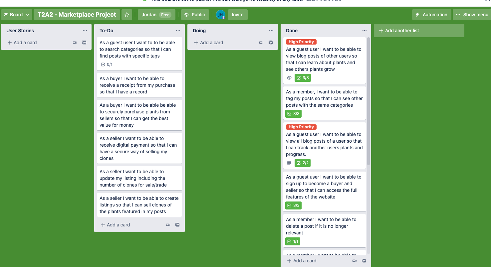
